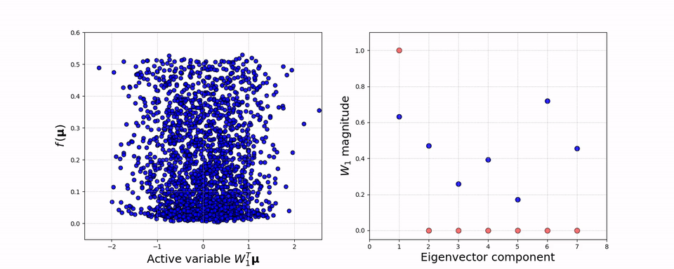
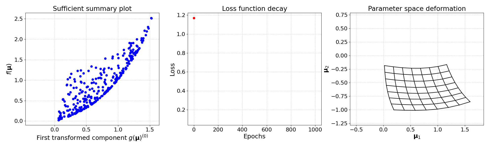

<p align="center">
  <a href="http://mathlab.github.io/ATHENA/" target="_blank" >
    
  </a>
</p>
<p align="center">
    <a href="https://github.com/mathLab/ATHENA/blob/master/LICENSE" target="_blank">
        
    </a>
    <a href="https://badge.fury.io/py/athena-mathlab" target="_blank">
      
    </a>
    <a href="https://github.com/mathLab/ATHENA/actions/workflows/ci.yml" target="_blank">
        
    </a>
    <a href="https://www.codacy.com/gh/mathLab/ATHENA/dashboard?utm_source=github.com&amp;utm_medium=referral&amp;utm_content=mathLab/ATHENA&amp;utm_campaign=Badge_Coverage">
        </a>
    <a href="https://app.codacy.com/gh/mathLab/ATHENA?utm_source=github.com&utm_medium=referral&utm_content=mathLab/ATHENA&utm_campaign=Badge_Grade_Settings" target="_blank">
        
    </a>
</p>

**ATHENA**: Advanced Techniques for High dimensional parameter spaces to Enhance Numerical Analysis

## Table of contents
* [Description](#description)
* [Dependencies and installation](#dependencies-and-installation)
	* [Installing from pip](#installing-from-pip)
  * [Installing from source](#installing-from-source)
* [Documentation](#documentation)
* [Testing](#testing)
* [Examples and tutorials](#examples-and-tutorials)
* [How to cite](#how-to-cite)
    * [References](#references)
	* [Recent works with ATHENA](#recent-works-with-athena)
* [Authors and contributors](#authors-and-contributors)
* [How to contribute](#how-to-contribute)
	* [Submitting a patch](#submitting-a-patch)
* [License](#license)

## Description
**ATHENA** is a Python package for reduction of high dimensional parameter spaces in the context of numerical analysis. It allows the use of several dimensionality reduction techniques such as Active Subspaces (AS), Kernel-based Active Subspaces (KAS), and Nonlinear Level-set Learning (NLL). It is particularly suited for the study of parametric PDEs, for sensitivity analysis, and for the approximation of engineering quantities of interest. It can handle both scalar and vectorial high dimensional functions, making it a useful tool also to reduce the burden of computational intensive optimization tasks.

See the [**Examples and Tutorials**](#examples-and-tutorials) section below and the [**tutorials folder**](tutorials/README.md) to have an idea of the potential of this package. Check also out the SISSA mathLab [medium publication](https://medium.com/sissa-mathlab) where you can find stories about ATHENA (search within the publication page).


## Dependencies and installation
**ATHENA** requires `numpy`, `matplotlib`, `scipy`, `torch`, `GPyOpt`,
`scikit-learn`, `scikit-learn-extra`, `sphinx` (for the documentation) and `pytest` (for local test).
The code is compatible with Python 3.8 and above. It can be installed directly
from the source code or via pip.

### Installing from pip
To install the latest release of the package, which corresponds to the online documentation, just type:
```bash
> pip install athena-mathlab
```

### Installing from source
To install the latest version of the package just type:
```bash
> pip install git+https://github.com/mathLab/ATHENA.git
```

The official distribution is on GitHub, and you can clone the repository using
```bash
> git clone https://github.com/mathLab/ATHENA
```

To install your own local branch you can use the `setup.py` file
```bash
> pip install -e .
```

To uninstall the package you have to rerun the installation and record the installed files in order to remove them:

```bash
> pip uninstall athena-mathlab
```

## Documentation
**ATHENA** uses [Sphinx](http://www.sphinx-doc.org/en/stable/) for code documentation. You can view the documentation online [here](http://mathlab.github.io/ATHENA/). To build the html version of the docs locally simply:

```bash
> cd docs
> make html
```

The generated html can be found in `docs/build/html`. Open up the `index.html` you find there to browse.


## Testing

We are using Github Actions for continuous intergration testing. You can check out the current status [here](https://github.com/mathLab/ATHENA/actions/workflows/testing_pr.yml).

To run tests locally (`pytest` is required):

```bash
> pytest
```

## Examples and tutorials
You can find useful tutorials on how to use the package in the [tutorials](tutorials/README.md) folder.

In the following some illustrative examples of what you can do with this package.

<p align="center">

</p>
<p align="center">
<em>A 7-dimensional quadratic function with a 1-dimensional active subspace.</em>
</p>

<p align="center">

</p>
<p align="center">
<em>Parameter space deformation using the nonlinear level-set learning technique for a 2-dimensional cubic function.</em>
</p>

## How to cite
If you use this package in your publications please cite the package as follows:

F. Romor, M. Tezzele, and G. Rozza. ATHENA: Advanced Techniques for High dimensional parameter spaces to Enhance Numerical Analysis. Software Impacts, 10:100133, 2021. doi:10.1016/j.simpa.2021.100133

Or if you use LaTeX:
```tex
@article{romor2020athena,
    author = {Romor, Francesco and Tezzele, Marco and Rozza, Gianluigi},
    doi = {10.1016/j.simpa.2021.100133},
    journal = {Software Impacts},
    pages = {100133},
    title = {{ATHENA: Advanced Techniques for High dimensional parameter spaces to Enhance Numerical Analysis}},
    volume = {10},
    year = {2021}}
```

### References
To implement the numerical methods present in this package we followed these works:

* Constantine. *Active subspaces: Emerging ideas for dimension reduction in parameter studies*. Volume 2 SIAM Spotlights, 2015. [[DOI](https://doi.org/10.1137/1.9781611973860)].

* Constantine et al. Python Active-subspaces Utility Library, Journal of Open Source Software, 1(5), 79, 2016. [[DOI](https://doi.org/10.21105/joss.00079)].

* Romor, Tezzele, Lario, Rozza. *Kernel-based Active Subspaces with application to CFD parametric problems using Discontinuous Galerkin method*. 2022. [[DOI](https://doi.org/10.1002/nme.7099)]

* Zhang, Zhang, Hinkle. *Learning nonlinear level sets for dimensionality reduction in function approximation*. Advances in Neural Information Processing Systems 32: Annual Conference on Neural Information Processing Systems 2019, NeurIPS 2019, 8-14 December 2019, Vancouver, BC, Canada. [[arXiv](https://arxiv.org/abs/1902.10652)].

* Romor, Tezzele, Rozza. *A local approach to parameter space reduction for regression and classification tasks*. 2021. [[arXiv](https://arxiv.org/abs/2107.10867)].


### Recent works with ATHENA
Here there is a list of the scientific works involving **ATHENA** you can consult and/or cite. If you want to add one, please open a PR.

* Tezzele, Romor, Rozza. *Reduction in Parameter Space*, in Advanced Reduced Order Methods and Applications in Computational Fluid Dynamics. 2022. [[DOI](https://doi.org/10.1137/1.9781611977257.ch16)].

* Tezzele, Fabris, Sidari, Sicchiero, Rozza. *A multi-fidelity approach coupling parameter space reduction and non-intrusive POD with application to structural optimization of passenger ship hulls*. 2022. [[DOI](https://doi.org/10.1002/nme.7159)].

* Teng, Wang, Ju, Gruber, Zhang. *Level set learning with pseudo-reversible neural networks for nonlinear dimension reduction in function approximation*. 2021. [[arXiv](https://arxiv.org/abs/2112.01438)].

* Romor, Tezzele, Rozza. *A local approach to parameter space reduction for regression and classification tasks*. 2021. [[arXiv](https://arxiv.org/abs/2107.10867)].

* Meneghetti, Demo, Rozza. *A Dimensionality Reduction Approach for Convolutional Neural Networks*. 2021. [[arXiv](https://arxiv.org/abs/2110.09163)].

* Demo, Tezzele, Mola, Rozza. *Hull shape design optimization with parameter space and model reductions and self-learning mesh morphing*. 2021. [[DOI](https://doi.org/10.3390/jmse9020185)], [[arXiv](https://arxiv.org/abs/2101.03781)].

* Romor, Tezzele, Rozza. *Multi-fidelity data fusion for the approximation of scalar functions with low intrinsic dimensionality through active subspaces*. 2020. [[DOI](https://doi.org/10.1002/pamm.202000349)], [[arXiv](https://arxiv.org/abs/2010.08349)].

* Romor, Tezzele, Lario, Rozza. *Kernel-based Active Subspaces with application to CFD parametric problems using Discontinuous Galerkin method*. 2022. [[DOI](https://doi.org/10.1002/nme.7099)]

* Demo, Tezzele, Rozza. *A supervised learning approach involving active subspaces for an efficient genetic algorithm in high-dimensional optimization problems*. 2020. [[DOI](https://doi.org/10.1137/20M1345219)], [[arXiv](https://arxiv.org/abs/2006.07282)].

* Tezzele, Demo, Stabile, Mola, Rozza. *Enhancing CFD predictions in shape design problems by model and parameter space reduction*. 2020. [[DOI](https://doi.org/10.1186/s40323-020-00177-y)], [[arXiv](https://arxiv.org/abs/2001.05237)].


## Authors and contributors
**ATHENA** is currently developed and mantained at [SISSA mathLab](http://mathlab.sissa.it/) by
* [Marco Tezzele](mailto:marcotez@gmail.com)
* [Francesco Romor](mailto:francesco.romor@gmail.com)

under the supervision of [Prof. Gianluigi Rozza](mailto:gianluigi.rozza@sissa.it).

Contact us by email for further information or questions about **ATHENA**, or suggest pull requests. Contributions improving either the code or the documentation are welcome!


## How to contribute
We'd love to accept your patches and contributions to this project. There are just a few small guidelines you need to follow.

### Submitting a patch

  1. It's generally best to start by opening a new issue describing the bug or
     feature you're intending to fix.  Even if you think it's relatively minor,
     it's helpful to know what people are working on.  Mention in the initial
     issue that you are planning to work on that bug or feature so that it can
     be assigned to you.

  2. Follow the normal process of [forking][] the project, and setup a new
     branch to work in.  It's important that each group of changes be done in
     separate branches in order to ensure that a pull request only includes the
     commits related to that bug or feature.

  3. To ensure properly formatted code, please make sure to use 4
     spaces to indent the code. The easy way is to run on your bash the provided
     script: ./code_formatter.sh. You should also run [pylint][] over your code.
     It's not strictly necessary that your code be completely "lint-free",
     but this will help you find common style issues.

  4. Any significant changes should almost always be accompanied by tests.  The
     project already has good test coverage, so look at some of the existing
     tests if you're unsure how to go about it. We're using [coveralls][] that
     is an invaluable tools for seeing which parts of your code aren't being
     exercised by your tests.

  5. Do your best to have [well-formed commit messages][] for each change.
     This provides consistency throughout the project, and ensures that commit
     messages are able to be formatted properly by various git tools.

  6. Finally, push the commits to your fork and submit a [pull request][]. Please,
     remember to rebase properly in order to maintain a clean, linear git history.

[forking]: https://help.github.com/articles/fork-a-repo
[pylint]: https://www.pylint.org/
[coveralls]: https://coveralls.io
[well-formed commit messages]: http://tbaggery.com/2008/04/19/a-note-about-git-commit-messages.html
[pull request]: https://help.github.com/articles/creating-a-pull-request


## License

See the [LICENSE](LICENSE.rst) file for license rights and limitations (MIT).
